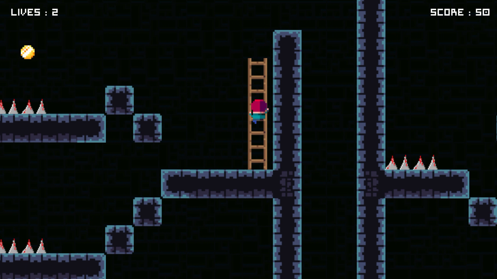

# TileVania 

### Introduction

    TileVania is a 2D platformer where characters run, jump, climb, and shoot. Navigate challenging level, 
    collect coins, and reach the exit while avoiding obstacles. This project places significant emphasis on 
    maintaining code quality and ensuring the game's adaptability for future enhancements.

### Features
    Beautiful Visuals and Soothing Music:
    - Beautifully designed level with soothing background music and sound effects.
    
    Core Gameplay:
    - Player actions include running, jumping, and shooting arrows.
    - Player lives are reduced upon contact with enemies and spikes.

    Ladders and Mushrooms:
    - Jumpy bouncy mushrooms aid players in reaching greater heights.
    - Ladders facilitate access to areas where the player cannot jump high enough.

    Pickups:
    - Collect coins to score.

    Smooth Camera Follow:
    - A smooth camera system ensures seamless tracking of the player's movements.
    
    User Interface (UI):
    - Main Menu, Game Over, Level Complete, Scoring, and Power-Up Gain pop-up screens.
    - Pause screen with options to resume and quit the game.
    
### Screenshots
   
   
   
   
   
   
   
   

  
### Code Structure and Game Design
#### Code Structure

    MVP (Model-View-Presenter):
        - The codebase is organized using the Model-View-Presenter (MVP) architectural pattern.
        - This approach maintains a clear separation of concerns:
           - The Model manages data.
           - The View acts as a passive component handled by Unity.
           - The Presenter is responsible for updating both the View and Model.
        - Classes for Player, Enemy, Arrow, Coin, Score, GameOver, LevelComplete, MainMenu, and 
          PlayerShooting have been implemented following the MVP pattern.

    Singletons:
        - Centralized control is ensured through the implementation of Singleton patterns.
        - Essential services such as PlayerService, EnemyService, AudioService, LayerService, CoinService,
          and ScoreService are designed as Singletons.
          
    Observer Pattern:
        - Utilized the observer pattern to decouple classes and handle events like arrow hits, notifying 
          the enemy Presenter of an enemy's demise, 
        - and OnPlayerDeath to facilitate the activation of the GameOver screen.
        
    Scriptable Objects:
       - Player, Enemy, Arrow, Coin.
       - Used for configuring their respective data.
       
#### Performance Optimization:

    - To optimize performance, object pooling is implemented for arrows, coins, and enemies, 
      which helps manage memory and CPU usage efficiently.

#### Input Management:

    - Integrated Unity's new Input System to simplify the mapping of inputs to in-game actions. 
    - Custom input actions like OnJump() and OnFire() have been defined for jumping and shooting.

#### Level Design:
    - Designed strategic level independently using provided assets.
    - For rapid level design, Unity's Tilemap was utilized, enabling expedited level creation by 
      painting tiles and specifying tilemap rules.
    - Created multiple layers, including platform, Enemy, Obstacle, Water, Bouncy, and Player, to 
      distinguish between different types of tiles.

#### Enchanced Camera Tracking

    - Employed Cinemachine to smoothly follow the player. 
    - Utilized state-driven cameras like the run camera, climb camera, and idle camera for seamless 
      transitions between different camera views.

#### Animations:

    - The Animator manages a range of animations, including Idle, Run, Climb, Jump, Shooting, and Hurt.

### Focus
    - Code Quality and Organization.
    - Architecture Design for Flexibility and Scalability.
    - Visually appealing, with soothing music and sound effects. 

### Gameplay Demonstration

    For a visual demonstration of the gameplay, watch video on YouTube:
   [Youtube video link](https://youtu.be/IphgE8X3xno)

### Play the Game

    To experience the game firsthand, play it directly by following this playable link:
   [Play in browser(WebGl)](https://rahul-pargi.itch.io/tilevania)
 

 
